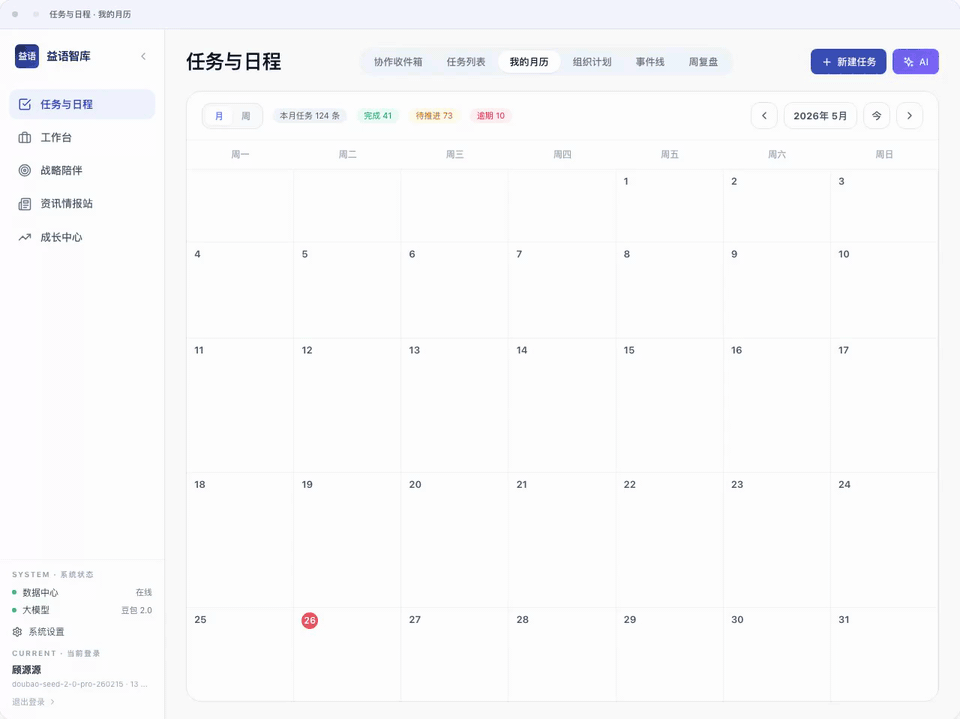
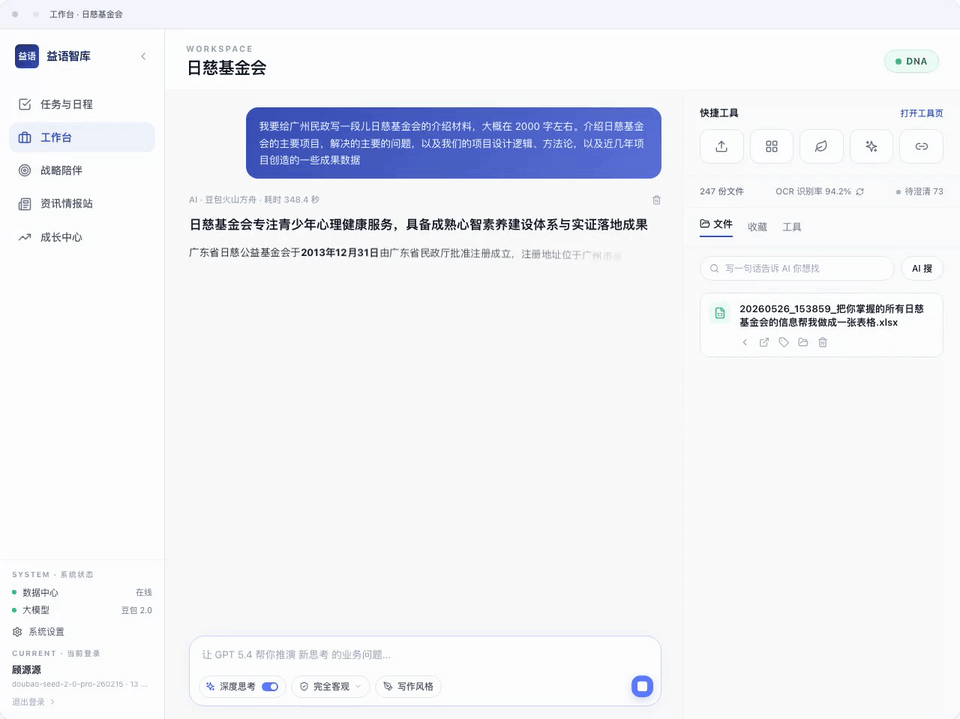
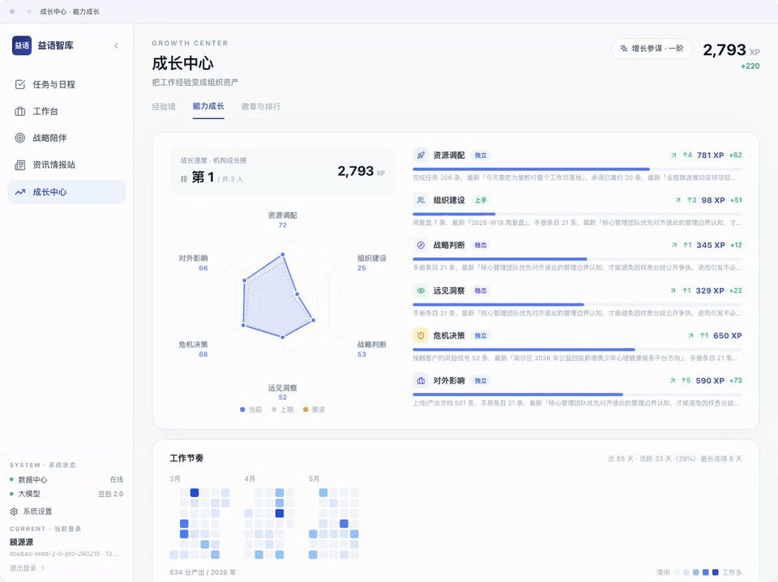

# 益语智库工作台

益语智库工作台是一款面向公益组织、小型团队和顾问型服务团队的 AI 协作桌面软件。它把任务协作、客户/项目资料、事件线、文档知识库、情报与舆情、周复盘和成长记录放在同一个工作台里，帮助团队把分散的信息转化为可执行的判断和行动。

> 当前仓库已公开开源。生产部署、组织云、AI、飞书、对象存储和发布分发相关密钥需要自行配置，仓库不包含任何运行时密钥。

## 功能模块

### 协作收件箱

协作收件箱用于集中处理“需要我确认、补充或反馈”的协作事项，避免任务通知散落在聊天、日历和文档里。它适合团队在多人协作时确认责任边界、同步任务状态，并把退回意见、确认动作和后续处理沉淀回同一条任务链路。

### 任务与日程

任务与日程负责把个人任务、协作任务、时间安排和复盘入口放在同一个视图里。用户可以创建任务、分配负责人和协作者、关联客户/项目或事件线，并在月历、任务列表和复盘入口之间流转。



它的价值不是只做一个待办列表，而是把“谁负责、何时做、为什么做、做到什么程度”连起来：任务可以进入事件线，重要任务可以参与复盘，时间安排可以同步到外部日历。

### 事件线

事件线用于围绕客户、项目、合作机会或组织议题沉淀关键进展。它把任务、备注、文件、决策和观察按时间串起来，帮助团队还原一件事从开始到当前的脉络。

在顾问型服务、公益项目推进和跨部门协作场景里，事件线可以减少“只记得结论，不知道依据”的问题。后续报告、复盘和 AI 总结都可以从事件线中提取证据。

### 工作台

工作台是项目资料和 AI 知识处理的主入口。用户可以导入文件、整理项目文档、查看解析状态、进行知识检索，并让 AI 基于当前项目资料回答问题或生成交付文本。



它适合处理客户资料、项目说明、访谈纪要、政策文件、调研材料和内部知识库。与普通文件夹不同，工作台强调“资料可被检索、可被引用、可被转化为判断和行动”。

### 战略陪伴

战略陪伴面向客户/项目的持续理解与判断。它维护客户档案、关键事实、判断思考、行动建议和澄清事项，让团队在长期服务中逐步形成对工作对象的共同认知。

这个模块适合顾问、项目负责人和组织管理者使用：一方面沉淀客户/项目的稳定背景，另一方面记录阶段性判断，避免每次讨论都从零开始。

### 资讯情报站

资讯情报站用于围绕工作对象持续抓取时效情报和舆情信号。它关注的不是“抓到越多越好”，而是从政策通知、公益创投、资助机会、行业动态、合作方变化和公开评价中识别对当前对象有启发的外部信号。

情报与舆情会尽量保留来源、时间、影响链条和下一步判断。用户可以追问、关注后续、转任务或不采纳，让系统逐步学习哪些信号真正有价值。

### 周复盘

周复盘帮助个人和团队把一周内的重要任务、事件、观察和成果重新整理成可复用的经验。它既可以用于个人工作回顾，也可以用于部门或组织层面的节奏校准。

复盘结果可以反哺任务、事件线和成长记录，让“做完了”进一步变成“知道怎么做得更好”。

### 成长中心

成长中心把任务复盘、经验沉淀、能力成长和徽章排行合在一起，帮助团队看到个人与组织能力的长期变化。它适合用来呈现经验金句、能力维度、成长等级和团队贡献。



这个模块的重点是把日常协作里的有效经验沉淀下来，而不是额外增加一套打卡系统。用户完成任务、复盘经验、沉淀方法后，成长中心会逐步形成个人和团队的成长画像。

### 集成能力

益语智库工作台支持云端协作、飞书消息/文档/日历、对象存储、语音转写和大模型配置。组织可以按需要接入自己的云端、模型和飞书应用；本地开发和演示场景也可以只启用部分能力。

这些集成能力服务于一个目标：让软件内部形成的任务、文档、情报和复盘结果，能够回到团队日常使用的沟通与协作环境中。

## 技术架构

- `src/`：Electron 主进程、preload、React/Vite 渲染端和共享类型。
- `backend/`：本地 FastAPI 后端，负责本机文件、知识库、AI 编排和本地运行时能力。
- `cloud_backend/`：云端 FastAPI 后端，负责账号、组织、协作同步、飞书集成和组织级配置。
- `scripts/`：本地开发、打包、发布和运行时检查脚本。
- `docs/`：公开架构、开发、配置、发布和法律合规文档。

更多结构说明见 [docs/architecture.md](docs/architecture.md)。

## 环境要求

- macOS（桌面端主要面向 macOS）
- Node.js 20+
- npm 10+
- Python 3.11+
- uv（Python 依赖和测试）

## 本地开发

```bash
npm install
cd backend && uv sync && cd ..
cd cloud_backend && uv sync && cd ..
cp .env.example .env
npm run build:main
npm run dev
```

默认开发模式不预置任何远端云地址。需要连接自建云端时，在 `.env` 或启动环境中配置 `YIYU_REMOTE_CLOUD_API_URL`。

## 常用命令

```bash
# 渲染端类型检查
npm run typecheck:renderer

# 本地后端测试
npm run backend:test

# 云端后端测试
npm run cloud:test

# 构建本地未签名 macOS 包
npm run dist:mac-local

# 构建并安装到本机测试
npm run install:mac-local
```

## 配置

复制 `.env.example` 为 `.env` 后按需填写。常见配置包括：

- `YIYU_REMOTE_CLOUD_API_URL`：自建云端协作服务地址。
- `YIYU_CLOUD_SECRET_KEY`：云端服务签名密钥。
- `YIYU_LLM_*`：大模型服务配置。
- `FEISHU_*`：飞书应用与机器人配置。
- `OBJECT_STORAGE_*`：对象存储配置。
- `SPEECH_*`：语音转写配置。
- `YIYU_UPDATE_FEED_URL`：桌面端更新源。

真实密钥、证书、数据库、日志和运行时文件不得提交到仓库。

## 安全扫描

仓库包含推送前和 CI 可复用的安全扫描脚本：

```bash
npm run security:scan
```

它会阻止 `.env`、数据库、日志、证书、私钥、发布密钥目录和疑似真实密钥进入源码树。DMG/ZIP 安装包不被视为密钥，但不建议作为普通源码提交；正式安装包应通过 GitHub Release 或火山云 TOS 发布。

## 文档

- [开发指南](docs/development.md)
- [配置说明](docs/configuration.md)
- [架构概览](docs/architecture.md)
- [发布说明](docs/release.md)
- [常见问题](docs/faq.md)
- [安全反馈](SECURITY.md)

## 许可证

本项目采用 [Apache License 2.0](LICENSE)。
