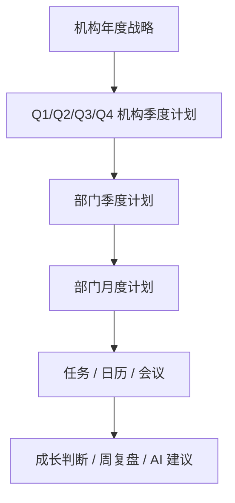

# 组织战略树 / 部门计划树 / 月度执行树设计稿

> 对齐说明（2026-03-21）：
> 本文档描述的是组织计划分解的结构层，但后续执行顺序已调整：
> `年度战略 -> 季度承接` 归入 `P1` 的 AI 背景母盘，
> `部门月度计划 -> 任务 / 日历 / 会议` 归入 `P2` 的执行浅入口。
> 统一以 [AI 背景优先总规划](./ai-context-first-rollout-plan.md) 和
> [全局模块改造清单与阶段路线图](./global-module-refactor-roadmap.md) 为准。

## 目标

把“机构介绍”升级为“可分解、可挂接、可追踪”的组织计划系统。

最终要实现的不是：

- 组织有一段介绍
- 部门有一段使命
- AI 基于几段大字介绍给出泛化建议

而是：

- 机构年度战略可拆到季度
- 季度目标可拆到部门季度计划
- 部门季度计划可拆到月度重点
- 月度重点可继续挂接具体任务、会议、日历和成长判断

只有这样，任务建议、成长提示、日历安排、复盘归因才会有足够细的上下文。

## 核心原则

1. 介绍不是目的，计划分解才是目的。
2. AI 不直接读取“整个组织介绍”，而是优先读取离当前动作最近的一层计划。
3. 每一条建议都要能说明：
   - 它服务哪个机构目标
   - 它属于哪个季度
   - 它属于哪个部门
   - 它属于哪个月度重点
4. 粒度至少到“部门季度计划 + 部门月度计划”。

## 结构总览

## 一、年度战略层

对象名建议：

- `organization_strategy_year`

字段建议：

- `id`
- `organization_id`
- `year`
- `annual_objective`
- `annual_narrative`
- `success_definition`
- `priority_tracks`
- `major_risks`
- `key_metrics`
- `owner_user_id`
- `status`
- `updated_at`

字段说明：

- `annual_objective`
  这一年机构最核心要完成什么。
- `annual_narrative`
  用一段较完整的话解释这一年为什么这么做。
- `success_definition`
  到年底怎样算做成。
- `priority_tracks`
  年度重点方向，建议 3 到 5 条。
- `major_risks`
  这一年最担心的断点。
- `key_metrics`
  最关键的少数衡量指标。

## 二、机构季度计划层

对象名建议：

- `organization_quarter_plan`

字段建议：

- `id`
- `organization_id`
- `year`
- `quarter`
- `theme`
- `quarter_goal`
- `quarter_narrative`
- `success_criteria`
- `key_bets`
- `stop_doing`
- `major_risks`
- `dependencies`
- `owner_user_id`
- `status`
- `updated_at`

字段说明：

- `theme`
  这一季度的主主题，例如“系统稳定性与关键闭环”。
- `quarter_goal`
  这一季度要完成的主目标。
- `quarter_narrative`
  这一季度的判断依据和方向解释。
- `success_criteria`
  本季度结束时，哪些结果说明这一季做成了。
- `key_bets`
  这一季度最值得押注的几个动作。
- `stop_doing`
  本季度明确不优先做什么。

## 三、部门季度计划层

对象名建议：

- `department_quarter_plan`

字段建议：

- `id`
- `organization_quarter_plan_id`
- `department_id`
- `year`
- `quarter`
- `department_mission`
- `quarter_goal`
- `quarter_role_in_org`
- `key_deliverables`
- `success_metrics`
- `key_actions`
- `dependencies`
- `support_needed`
- `major_risks`
- `owner_user_id`
- `status`
- `updated_at`

字段说明：

- `department_mission`
  这个部门长期负责什么，不是本季度临时任务。
- `quarter_role_in_org`
  这个部门在当前季度承接机构季度目标的哪一部分。
- `quarter_goal`
  该部门本季度的目标。
- `key_deliverables`
  本季度必须产出的关键成果。
- `success_metrics`
  部门层怎样算达标。
- `key_actions`
  部门本季度关键动作。

## 四、部门月度计划层

对象名建议：

- `department_month_plan`

字段建议：

- `id`
- `department_quarter_plan_id`
- `department_id`
- `year`
- `month`
- `month_theme`
- `month_focus`
- `key_actions`
- `planned_outputs`
- `planned_meetings`
- `planned_tasks`
- `risks`
- `dependencies`
- `owner_user_id`
- `status`
- `updated_at`

字段说明：

- `month_theme`
  这个月的主题。
- `month_focus`
  这个月最重要的重点。
- `key_actions`
  这个月要推进的 3 到 5 个关键动作。
- `planned_outputs`
  这个月应该产生什么成果。
- `planned_meetings`
  这个月必须安排的会议类型或会议节点。
- `planned_tasks`
  这个月要拆成任务包的动作。

## 五、执行挂接层

对象名建议：

- `task_context_binding`
- `meeting_context_binding`
- `calendar_context_binding`

### `task_context_binding`

字段建议：

- `task_id`
- `organization_strategy_year_id`
- `organization_quarter_plan_id`
- `department_quarter_plan_id`
- `department_month_plan_id`
- `department_id`
- `binding_reason`
- `confidence`
- `confirmed_by_user`
- `updated_at`

### `meeting_context_binding`

字段建议：

- `meeting_id`
- `organization_quarter_plan_id`
- `department_quarter_plan_id`
- `department_month_plan_id`
- `department_id`
- `binding_reason`
- `confidence`
- `confirmed_by_user`
- `updated_at`

### `calendar_context_binding`

字段建议：

- `calendar_item_id`
- `department_month_plan_id`
- `department_id`
- `binding_reason`
- `confidence`
- `confirmed_by_user`
- `updated_at`

## 六、AI 的上下文读取规则

AI 不应该每次都读取整套组织材料，而是按“离当前动作最近”的层级读取。

### 在任务与日历

优先读取：

1. `department_month_plan`
2. `department_quarter_plan`
3. `organization_quarter_plan`
4. `organization_strategy_year`

### 在部门管理 / 组织搭建中心

优先读取：

1. `department_quarter_plan`
2. `organization_quarter_plan`
3. `organization_strategy_year`

### 在成长系统

优先读取：

1. 当前任务或会议绑定的 `department_month_plan`
2. 所属 `department_quarter_plan`
3. 所属 `organization_quarter_plan`
4. 对应 `growth_rubric`

### 在全局助理

优先读取：

1. 当前所在模块的最近执行层
2. 当前部门月度重点
3. 当前季度目标

不要默认直接读取整套组织介绍。

## 七、建议系统如何变得更有针对性

当 AI 建议读取到这条链以后，它才能判断：

- 这个任务是不是本月重点的一部分
- 这个会议是不是应该发生在本月
- 这个部门当前最缺的是目标、任务、成员还是计划
- 这个成长建议是不是对当前季度真正有用

建议从“泛建议”变成“挂接建议”：

- 不是“建议建立周计划”
- 而是“科技发展部本月还没有承接 Q2 的系统稳定性动作，建议先补本月计划”

- 不是“建议记录成长”
- 而是“这条任务直接对应咨询策略部 Q2 的场景判断目标，可沉淀为分析判断能力证据”

## 八、页面层应该怎么调整

### 组织层卡片

当前不应只显示：

- 机构名称
- 一段机构介绍

应该至少显示：

- 年度目标
- 当前季度主题
- 当前季度目标
- 当前季度成功标准
- 当前季度风险

### 部门卡片

当前不应只显示：

- 部门名称
- 负责人
- 部门使命
- 季度重点

应该至少显示：

- 部门职责
- 当前季度目标
- 当前季度关键产出
- 当前季度成功标准
- 当前月重点
- 当前计划数
- 当前任务数
- 当前风险

### 右侧编辑区

建议分成两层编辑：

1. 部门基础信息
   - 部门名称
   - 负责人
   - 部门使命

2. 部门计划信息
   - 本季度目标
   - 本季度关键产出
   - 本季度成功标准
   - 本月重点
   - 本月关键动作

## 九、任务与日历需要新增的承接层

任务与日历不只是一张通用任务表，它应该承接“月度执行层”。

建议新增：

- 部门月度计划创建入口
- 每月重点事项编辑区
- 从月度重点一键生成任务包
- 从月度重点一键排日程
- 任务自动挂接到月度计划

这一步做完，任务页里的建议和排序才会更准。

## 十、成长系统怎么吃这套结构

成长判断不再只看“做了什么”，而是看：

- 在哪个部门
- 对应哪个季度目标
- 属于哪个月度重点
- 这次行为对当前阶段最重要的能力有什么贡献

判断公式建议：

`执行证据 + 月度重点 + 部门季度目标 + 项目标尺 = 成长判断`

这样勋章、XP、学习推荐就不再是空泛奖励，而是有组织语境的判断。

## 十一、实施顺序

第一阶段：

1. 把机构层从“介绍”升级成“年度目标 + Q1/Q2/Q3/Q4”
2. 每个部门补“季度目标”

第二阶段：

1. 在任务与日历里增加“部门月度计划”
2. 任务、会议、日程开始挂接月度计划

第三阶段：

1. 成长系统开始读取月度计划和季度目标
2. AI 建议系统按最近层上下文出建议

第四阶段：

1. 全局助理接入这套计划树
2. 做“漏步骤”和“最佳路径”的精准提醒

## 十二、最小闭环

第一版最小可用闭环建议只先跑通：

1. 机构年度目标
2. 当前季度机构计划
3. 每个部门的当前季度计划
4. 每个部门的本月重点
5. 任务自动挂接到本月重点

先不要一口气做全年所有月度、所有季度联动。

只要这 5 步跑通，AI 建议的针对性就会明显提升。
