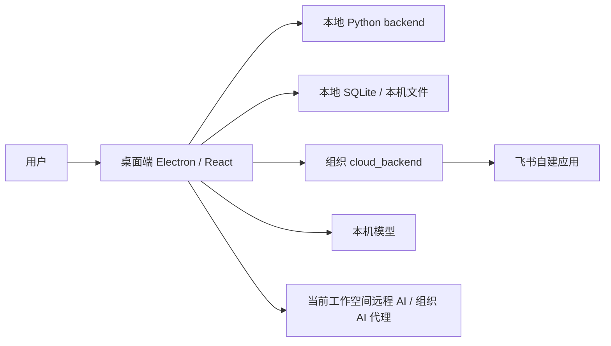

# 《协作开发指引》

欢迎参与益语智库 AI 工作系统的共建。

这份文档写给第一次接触本仓库的开发者。你可以只贡献一个小修复、一段可参考代码、一个平台适配经验，也可以认领官网上公开的模块需求。无论贡献大小，请先理解这个项目的产品边界和底层架构，再动代码。

## 1. 这个软件在解决什么问题

益语智库 AI 工作系统不是一个通用聊天工具，也不是一个单纯的文档管理器。它面向公益组织、行动者团队、研究与协作型工作，帮助用户把客户、任务、文档、会议、复盘、知识沉淀、AI 辅助和组织协作连接起来。

我们更看重三件事：

- **可信**：用户资料、组织数据、AI key、飞书授权、云端连接不能混淆，不能因为新增功能破坏已有工作流。
- **轻量**：优先补齐关键链路，不把简单问题做成重型平台。
- **可持续迭代**：开发节奏可以快，正式发版节奏必须慢。面向普通用户的更新必须是稳定版本。

如果你的改动会让用户多配置一个系统、多理解一个技术概念，或让某个模块绕过现有架构直接另起一条线，请先在 Issue 或 PR 说明里讲清楚为什么值得。

## 2. 仓库结构速览

本仓库是桌面软件和相关服务的主仓：

- `src/`：Electron 主进程、preload bridge、共享 TypeScript、React 渲染层。
- `backend/`：本地 Python 后端，负责文件处理、知识流程、本地 AI 接入等。
- `cloud_backend/`：组织协作云端服务，用于账号、组织、任务同步、飞书、组织 AI 等能力。
- `mobile/`：移动端代码。当前移动端能力仍在迭代，请避免假设它和桌面端完全等价。
- `scripts/`：构建、打包、发版、检查和迁移脚本。
- `docs/`：设计说明、审计报告、协作资料和阶段性文档。

典型运行关系：



## 3. 先理解工作空间边界

本项目正在从早期单一使用场景，逐步收口为“工作空间”模型。前端可称为工作空间，底层通常叫 `sandbox`。

你需要特别注意：

- 工作空间代表组织或当前连接上下文，客户、任务、文档、AI、飞书、云地址和 token 不应互相串用。
- 组织数据不能漏到另一个组织；本地草稿也不能被误认为正式组织数据。
- 远程 AI key、飞书 App Secret、云 token 必须跟随当前工作空间；本机本地模型可以作为设备级能力被多个工作空间选择。
- 新增查询、统计、搜索、成长中心、知识库、复盘、会议、任务等功能时，必须确认是否需要按当前工作空间过滤。

如果你改的是列表、搜索、统计、同步或缓存，默认都要问自己一句：**切换到另一个工作空间后，这些数据还应该出现吗？**

## 4. 飞书、日历和任务同步边界

飞书能力依赖组织或个人配置的飞书企业自建应用。

当前设计原则：

- 益语任务和飞书任务都可以作为真实任务入口。
- 飞书日历和手机系统日历只作为提醒镜像，不作为任务编辑入口。
- 任务、飞书任务、飞书日历事件之间必须尽量保持一对一映射，不能靠标题或时间猜测删除或改绑。
- 删除必须依赖精确映射；完成任务只同步完成状态，默认不删除日历提醒历史。
- 成员身份绑定、手机号匹配、open_id 匹配都要避免把任务错误分配给别人。

如果你贡献飞书相关代码，请优先保守处理异常。宁可记录诊断和失败状态，也不要自动抢绑、误删或猜测成员。

## 5. AI 能力边界

本项目支持多种 AI 来源：

- 本机本地模型，例如 Ollama 或本机 OpenAI-compatible 服务。
- 当前工作空间的远程 AI 配置。
- 组织管理员配置后由云端代理的组织 AI。

请遵守：

- 普通成员不应看到或保存管理员的 raw API key。
- 本地模型是设备级能力；公网或局域网模型仍按远程 AI 看待。
- 组织 AI 代理应走当前组织工作空间，不要跨组织复用状态。
- AI 失败时可以有规则兜底，但必须明确标注，不要把规则结果包装成 AI 结果。

## 6. 哪些贡献比较适合外部开发者

官网上可能会开放一些“可认领”需求。第一批方向偏向可独立探索或可提供经验的模块，例如：

- Linux 版开发。
- 本地 NaaS / 私有云版开发。
- iOS 版开发。
- 根据背景知识自动生成任务 brief。
- 软件接入的 AI agent 定期自我复盘。
- 软件视觉细节优化。
- 本地大模型小白一键配置。

你不一定要完整交付一个大功能。可接受的贡献包括：

- 最小可运行原型。
- 针对某平台的打包、签名、依赖经验。
- 一个模块的关键 bug 修复。
- 小范围 UI 细节优化。
- 一份清楚的技术验证报告。

## 7. 开始开发前

请先完成：

1. 阅读 `README.md` 和本指引。
2. 找到你要回应的 Issue、官网认领需求或你自己发现的问题。
3. 确认你的改动属于桌面端、本地后端、云端、移动端还是文档。
4. 从最新 `main` 拉取代码，新建自己的分支。
5. 尽量把一次 PR 控制在一个明确目标内。

建议分支命名：

```bash
git checkout main
git pull origin main
git checkout -b feature/your-topic
```

## 8. 本地开发

安装依赖：

```bash
npm ci
```

启动桌面端开发环境：

```bash
npm run dev
```

常用检查：

```bash
npm run build:main
npm run typecheck:renderer
npm run build:backend-check
```

如果改到云端：

```bash
cd cloud_backend
uv run pytest
```

如果改到移动端：

```bash
npm --prefix mobile run test:core
cd mobile && npx tsc --noEmit --pretty false
```

请按你的改动范围选择测试，不要求所有 PR 都跑完整发版链路，但必须说明你跑过什么、没跑什么。

## 9. 改代码时的底层原则

### 保持小步

不要为了修一个按钮，顺手重构整个页面；不要为了接一个接口，重写整个同步系统。项目还在快速演进，过大的无关重构会让维护者很难判断风险。

### 尊重已有边界

优先使用已有服务、表、状态管理、API helper、同步队列和错误处理方式。只有当现有边界真的不够用时，才新增抽象。

### 不增加不必要的线

如果一个能力已经通过本地 backend、cloud_backend 或飞书自建应用实现，不要再另起一套平行通道。新通道会造成配置、权限、缓存和同步状态打架。

### 先保证不串数据

涉及工作空间、组织、客户、任务、文档、AI、飞书、对象存储、统计、成长中心、知识库和搜索时，优先检查数据归属和过滤。

### 失败要可解释

同步、AI、飞书、云端请求失败时，应返回用户能理解的提示，并保留开发者能排查的日志或状态。不要静默吞掉，也不要让失败状态污染别的工作空间。

## 10. 不要提交这些内容

请不要提交：

- 真实客户、组织、项目、会议纪要、报告或内部 dogfood 数据。
- `.env`、私钥、证书、token、API key、数据库 dump。
- 真实云 IP、生产后端地址或账号密码。
- 构建产物、安装包、缓存、日志、`node_modules/`。
- 大段截图 base64 或无法审查的二进制内容。

提交前建议运行：

```bash
npm run check:source-cleanliness
```

如果测试需要样例数据，请使用最小占位数据，例如“测试客户 A / 测试项目 A”，且不要把它包装成真实 demo。

## 11. PR 应该怎么写

PR 描述建议包含：

- 你解决的问题是什么。
- 用户会看到什么变化。
- 改动涉及哪些模块。
- 是否影响工作空间、云端、AI、飞书、任务同步、发版更新。
- 你跑过哪些检查。
- 还有哪些风险或未完成事项。

一个简单模板：

```md
## 目标

## 改动

## 测试

## 风险与边界
```

如果 PR 是回应官网认领需求，请在标题或正文里提到对应 Issue 编号或需求标题。即使没有严格一需求一 PR，也能帮助维护者用 Codex/Claude 分析贡献是否回应了需求。

## 12. 评审会重点看什么

维护者通常会优先看：

- 是否破坏已有用户数据或同步链路。
- 是否跨工作空间串数据。
- 是否泄露 key、token、真实客户信息。
- 是否新增了不必要的配置、服务或依赖。
- 是否让普通用户更难安装、更新或理解。
- 是否有足够的测试或手动验证说明。

如果你的 PR 暂时只是探索，请明确写成 draft，不要让维护者误以为它已经可以发版。

## 13. 发版不是合并 PR

本仓库的 `main` 是源码基线，但普通用户安装包来自益语智库官网和正式更新源。合并 PR 不等于立即进入正式安装包。

正式发版通常需要：

1. 维护者确认版本内容。
2. 从确定的 tag 构建。
3. macOS 签名和公证。
4. Windows 签名或内部测试包流程。
5. 上传官网和更新源。
6. 网站后台发布版本。

因此，请不要在 PR 中自行修改正式更新源、发布记录、签名配置或生产下载地址，除非维护者明确要求。

## 14. 沟通方式

你可以通过 GitHub Issue 或 PR 讨论具体实现。请尽量把问题描述为：

- 当前现象。
- 期望行为。
- 你已经排查到的线索。
- 你准备怎么改。

如果你只是想先认领一个方向，可以在官网“参与模块共建”里填写 GitHub 账号，然后到对应 Issue 下继续沟通。

感谢你参与共建。这个项目的价值不只在代码，也在于让公益组织和行动者能更稳定地把工作沉淀下来。请把每次改动都当作对真实用户工作流的一次小心接力。
